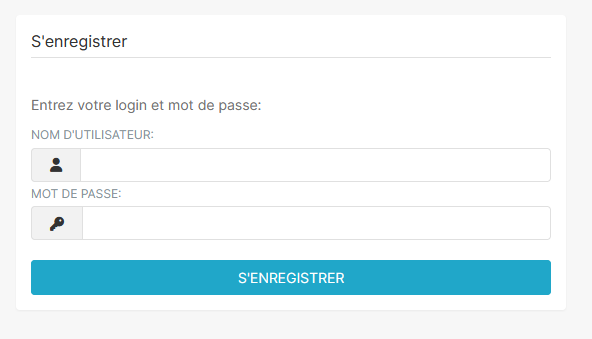
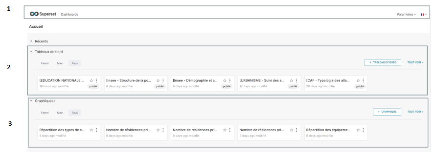

# 1- Comment accéder à superset ?

Afin d'utiliser Superset, les utilisateurs doivent suivre une procédure de création de compte et s'assurer d'avoir des identifiants valides

## Création de compte

Pour demander un accès :

* Envoyez un e-mail à l'adresse suivante : [sig@lunelagglo.fr](mailto:sig@lunelagglo.fr)

* Un formulaire de création de compte vous sera transmis par retour de mail.

* Complétez le formulaire avec soin et retournez-le par e-mail à la même adresse.
	
> ⚠️ Assurez-vous que toutes les informations fournies sont exactes pour éviter tout retard dans le processus.

## Connexion à Superset

Une fois votre compte créé :

-Copiez-collez l'URL suivante dans votre navigateur : [https://observatoire.lunelagglo.fr/](https://observatoire.lunelagglo.fr/)

-Entrez votre identifiant et mot de passe. Veillez à respecter les majuscules et minuscules.

> ⚠️ L'application nécessite impérativement un compte utilisateur. Il n'y a pas d'accès public à Superset.

# 2- Interface de Superset :

Une fois connecté à Superset, l'utilisateur est accueilli par une interface claire et fonctionnelle : 

## 1) Barre de navigation

**Bouton "Dashboards" :** Placé à côté du logo, il redirige directement vers la liste des tableaux de bord disponibles.

**Paramètres :** Situé à droite, ce bouton donne accès aux options de configuration utilisateur ou aux paramètres avancés de l'application.

**Langue :** Juste à côté des paramètres, cet élément permet de sélectionner la langue d'affichage de l'interface en fonction des préférences de l'utilisateur.

## 2) Tableaux de bord récents

Une section affichant les tableaux de bord récemment consultés ou modifiés pour un accès rapide.

## 3) Graphiques récents

Cette section affiche les graphiques récemment modifiés ou ajoutés par les administrateurs. Les utilisateurs peuvent les consulter pour visualiser les dernières mises à jour et analyses préparées.

# 3- Exemple de structure d'un tableau de bord :

	1- Menu de navigation
	2- Filtres
	3- Titre du tableau de bord
	4- Onglets principaux
	5- Menus d'actions

## 1) Menu de navigation : 
Le menu de navigation de Superset est l'élément principal qui permet aux utilisateurs de se déplacer dans l'application et d'accéder rapidement à leurs outils et fonctionnalités préférés.

-Cliquez sur le bouton "Dashboard" de le menu de navigation.

-Cela vous redirigera vers la liste de tous les tableaux de bord disponibles.

 

### Rechercher un tableau de bord spécifique : 
Utilisez la barre de recherche située en haut de la page des tableaux de bord pour trouver celui qui vous intéresse.
Vous pouvez affiner votre recherche en utilisant différents critères (Nom, Etat, Propriétaire, Favori, Certified, Modifié)

 

## 2) Filtres : 
Superset propose des filtres interactifs pour explorer les données de manière ciblée. Vous pouvez facilement sélectionner une année et une commune spécifiques afin de visualiser les graphiques et analyses correspondants.

 

Afin d'appliquer vos sélections, cliquez sur le bouton **APPLIQUER LES FILTRES** :

 

### Application des Filtres et Impact sur les Graphiques :
Lorsqu'un filtre est appliqué, il est important de noter que son effet dépend des graphiques associés. Certains graphiques afficheront les données filtrées uniquement si le filtre leur est appliqué. Voici comment cela se manifeste :

-Si 1 apparaît, cela signifie qu'un filtre est appliqué à ce graphique.

  

-Si 2 apparaît, cela indique que deux filtres sont appliqués.

  

  Ce système permet aux utilisateurs de savoir combien de filtres influencent un graphique spécifique, offrant une meilleure compréhension des analyses affichées.
  
 

## 3) Titre du tableau de bord : 
Le titre du tableau de bord permet aux utilisateurs de rapidement identifier le contenu ou l'objectif du tableau.

 

## 4) Onglets principaux :
Les onglets principaux permettent de diviser le tableau de bord en sections. Chaque onglet peut contenir des graphiques spécifiques ou des catégories d'analyses.

 

## 5) Menu d'actions :

**Menu d'actions des graphiques :** Ce menu, situé en haut à droite de chaque graphique, permet aux utilisateurs d'interagir directement avec un graphique spécifique (forcer l'actualisation, passer en plein écran, partager, télécharger)

  

**Menu d'actions du tableau de bord :** Ce menu, situé en haut à droite de l'ensemble du tableau de bord, offre des fonctionnalités globales qui s'appliquent à l'intégralité du tableau (actualiser le tableau de bord, passer en plein écran, enregistrer sous, télécharger, partager, gérer les rapports par e-mail, définir un intervalle de rafraîchissement automatique).

  
  
 

### Téléchargement des graphiques et tableaux de bord :
Superset permet de télécharger non seulement les graphiques individuels, mais également les tableaux de bord complets. Voici les étapes :

Télécharger un graphique individuel :

 1. Cliquez sur le menu d'action des graphiques.
 2. Sélectionnez Télécharger.
 3.Choisissez le format souhaité (par exemple, CSV ou PNG).

  

Télécharger un tableau de bord complet :

 1. Cliquez sur le menu d'action du tableau de bord.
    
 3. Sélectionnez l'option Télécharger.
    
 5. Choisissez le format : PDF ou image JPEG.
    
 7. Le fichier téléchargé contiendra l'intégralité du tableau de bord pour une consultation ou une utilisation ultérieure.

  

   

### Gérer les rapports par e-mail :
Superset offre la possibilité de configurer des rapports automatiques par e-mail via l'option Manage Email Report, qui se trouve dans le menu d'actions du tableau de bord. Cette fonctionnalité permet de programmer l'envoi régulier des tableaux de bord à des destinataires spécifiques.

 1. Set up an email report

-Cliquez sur Manage email report dans le menu d'actions du tableau de bord.
-Choisissez l'option Set up an email report.

  

2. Personnalisation des paramètres d'envoi

-Définissez la fréquence d'envoi selon vos besoins :
	 
 ○ Chaque semaine
 
 ○ Chaque mois
 
 ○ Chaque jour
 
 ○ Chaque année
 
 ○ Chaque heure

  

3. Sélectionnez également :
    
- Le jour de la semaine où le rapport doit être envoyé (par exemple, lundi ou vendredi).
- L'heure exacte à laquelle l'e-mail sera envoyé.

  
